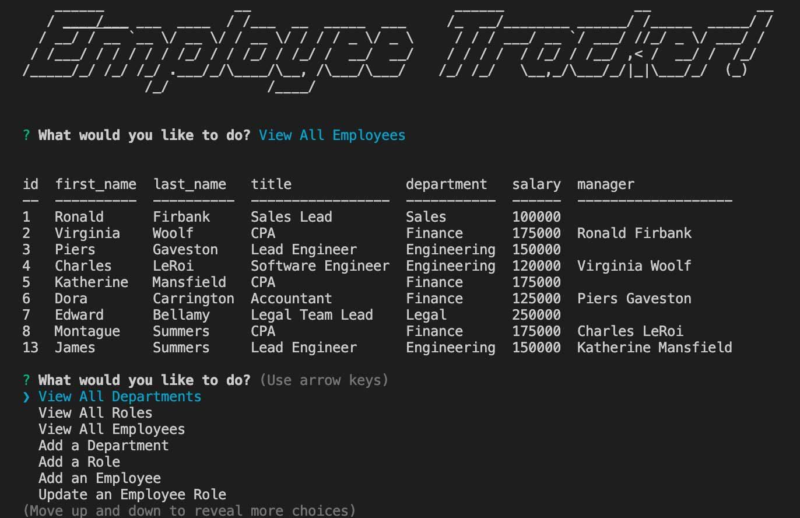

  
  # MySQL Employee Tracker CLI 

  ## Table of Contents
  * [ Description ](#about)
  * [ Installation ](#installation)
  * [ Usage ](#usage)
  * [ License ](#license)
  * [ Questions ](#questions)

  
  ## Description
  A command-line application that uses Node.js, Inquirer, and MySQL to manage a company's employee database.

  
  ## Installation
  run `git clone https://github.com/cshepscorp/sql-employee-tracker.git` to clone onto your machine
  run `npm install` to install the appropriate packages for this application 

  
  ## Usage
  run `node server.js` to launch the application

  ([Walkthrough video - how to use the application](https://watch.screencastify.com/v/oEjwasOp7xwvdfTpoHzB))
  
  

  
  ## License
  MIT - A short and simple permissive license with conditions only requiring preservation of copyright and license notices. Licensed works, modifications, and larger works may be distributed under different terms and without source code. ([Read more about the MIT license](https://choosealicense.com/licenses/mit/))

  
  ## Questions
  Feel free to reach out to me with any additional questions
  * [Find me on GitHub](https://github.com/cshepcsorp/)
  * Email me at: sheppard.christy@gmail.com
